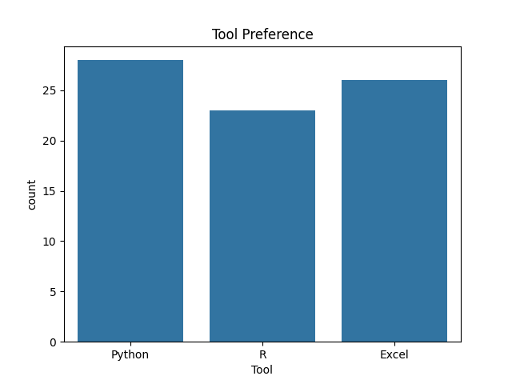
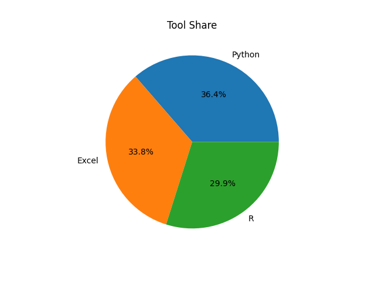
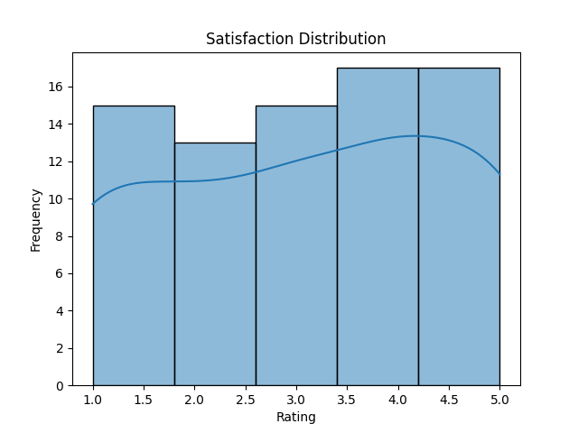
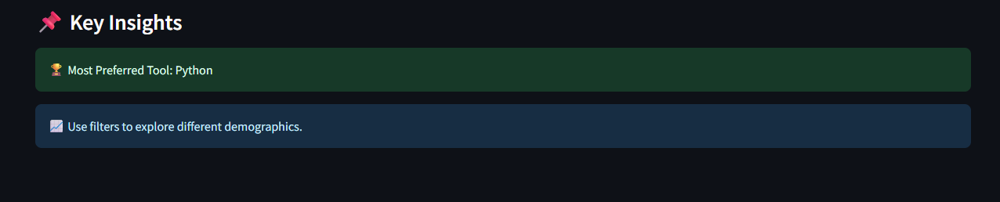
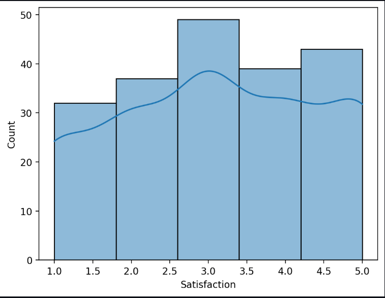
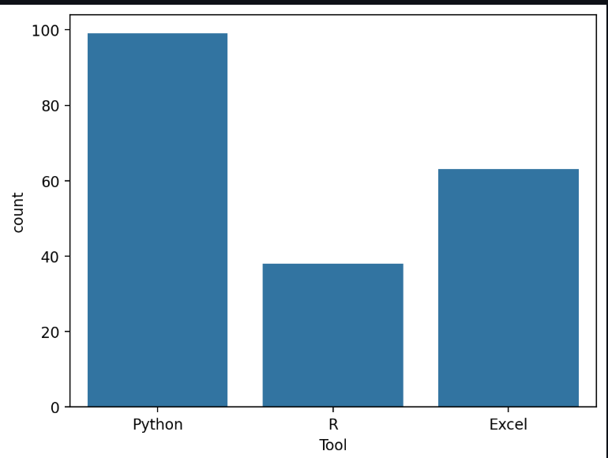
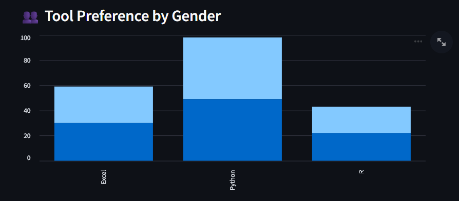
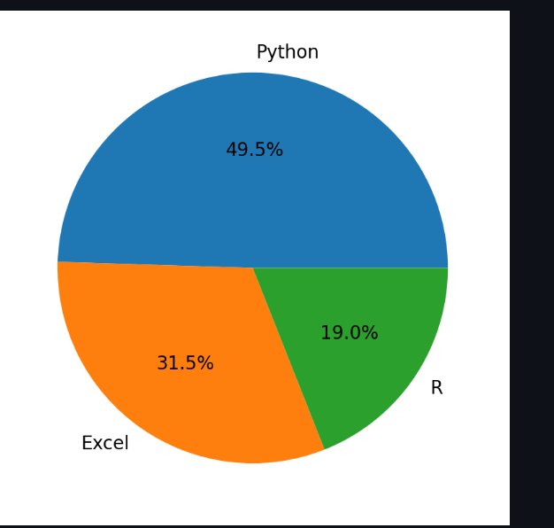

## Poll Results Visualizer using Data Science

## Overview

An end-to-end data science system designed to analyze and visualize poll or survey data.

This project simulates real-world survey analytics scenarios and provides actionable insights through structured data analysis and visualizations.

## Problem Statement

Poll and survey data often faces multiple challenges:

- Unstructured and raw responses
- Difficulty in identifying trends and patterns
- Time-consuming manual analysis
- Lack of clear and interactive visualizations

## Solution

This system uses data science techniques to:

- Collect or simulate poll responses
- Clean and preprocess survey data
- Analyze vote distribution and trends
- Compare demographic insights
- Generate meaningful visualizations and insights

## Key Features

- End-to-end pipeline (Data → Preprocessing → Analysis → Visualization)
- Synthetic poll data simulation
- Option-wise vote/share analysis
- Demographic-based comparison (Age, Gender)
- Trend and distribution analysis
- Clean and modular project structure

## 📊 Visualization Preview

### 📌 Bar Chart

### 📌 Pie Chart

### 📌 Histogram

## Sample Output

- Input: Synthetic poll dataset
- Output: Vote distribution charts, percentage analysis, and insights

## Tech Stack

- Python

- Pandas, NumPy

- Matplotlib / Seaborn

- Streamlit (for dashboard)

## Project Structure

Poll-Results-Visualizer/
│
├── app/
│   └── app.py
│
├── data/
│   └── poll_data.csv
│
├── images/
│   ├── dashboard_key_insights.png
│   ├── dashboard_satisfaction_distribution.png
│   ├── dashboard_tool_preference_bar_chart.png
│   ├── dashboard_tool_preference_by_gender.png
│   └── dashboard_tool_share_pie_chart.png
│
├── outputs/
│   ├── bar_chart.png
│   ├── pie_chart.png
│   └── histogram.png
│
├── src/
│   ├── data_generator.py
│   ├── preprocessing.py
│   ├── analysis.py
│   └── visualization.py
│
├── notebooks/
│
├── main.py
├── requirements.txt
├── .gitignore
└── README.md

## 📊 Interactive  Dashboard 

### 📌 Key Insights

### 📌 Satisfaction Distribution

### 📌 Tool Preference (Bar Chart)

### 📌 Tool Preference by Gender

### 📌 Tool Share (Pie Chart)

## How It Works

- Poll data is generated using synthetic simulation
- Data is cleaned and standardized
- Analysis is performed on vote distribution and demographics
- Visualizations are created for better understanding
- Insights are generated to identify trends and preferences

## How to Run

1. Install dependencies

pip install -r requirements.txt

2. Run main pipeline

python main.py

3. Run dashboard

streamlit run app.py

4. View outputs

outputs/

## Future Improvements

- Real-time polling system
- AI-based sentiment analysis on feedback
- Live dashboard updates
- CSV / Google Forms integration
- API-based data ingestion

## Author

Nikhat Jahan
GitHub: https://github.com/Nikhatjahan85

## Final Note

This project demonstrates how data science can be applied to analyze poll and survey data, enabling organizations to make data-driven decisions through clear visual insights.
